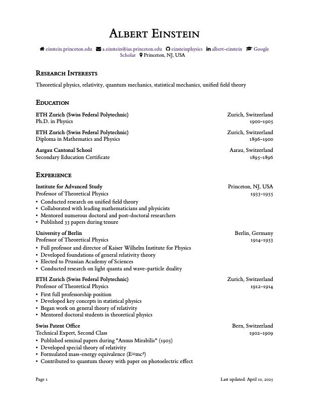

# CleanCV: A Minimalist Academic CV Template for LaTeX ��

A professional, elegant LaTeX template for academic CVs that focuses on content and readability. Perfect for researchers, professors, and graduate students who want to make a strong impression.



## GitHub Repository Descriptions

- **Main**: "Minimalist LaTeX CV template for academics with clean typography and professional design"
- **Short**: "Elegant academic CV template with BibLaTeX support"
- **SEO-friendly**: "Clean LaTeX CV template for researchers, professors, and PhD students"

## ✨ Features

CleanCV stands out from other academic templates with:

- **Exceptional typography** using elegant ET Book font and proper spacing
- **Publication-ready design** that academic committees will appreciate
- **BibLaTeX integration** with automatic name highlighting and joint first-author marking
- **Flexible structure** with CV/Resume modes to adjust content depth
- **Hyperlinked content** for digital sharing
- **Contact bar with icons** for a modern, professional look
- **Automatic footer** with "Last Updated" date
- **No dependencies** on complex LaTeX packages

## �� Quick Start

### Option 1: Use on Overleaf (Recommended)
1. Create a [new Overleaf project](https://www.overleaf.com/learn/how-to/Creating_a_document_in_Overleaf)
2. Copy the `main.tex`, `cleanCV.sty`, and `publications.bib` files to your project

### Option 2: Use Locally
1. Ensure you have LaTeX installed ([Get LaTeX](https://www.latex-project.org/get/))
2. Clone this repository:
   ```bash
   git clone https://github.com/yourusername/CleanCV.git
   ```

### Overleaf + GitHub Integration
You can [sync Overleaf with GitHub](https://www.overleaf.com/learn/how-to/Git_Integration_and_GitHub_Synchronization) for version control (requires Overleaf premium).

## �� Usage Guide

### Basic Content Commands

CleanCV provides two primary commands for adding content:

#### 1. `\cventry` - For detailed entries (education, experience)

```latex
\cventry[
    \item First bullet point about this position
    \item Second bullet point with accomplishments
]{Institution/Company}{Location}{Role/Degree}{Year/Date Range}
```

For entries without bullet points, leave the first argument empty:

```latex
\cventry{University Name}{City, Country}{Degree Program}{2018-2022}
```

#### 2. `\cvitem` - For simple entries (awards, talks, etc.)

```latex
\cvitem{Organization}{Award/Talk Name}{Year}
```

### Section Examples

#### Education Section

```latex
\section*{Education}

\cventry{Princeton University}{Princeton, NJ, USA}{Ph.D. in Physics}{1934-1938}
\medskip
\cventry{MIT}{Cambridge, MA}{M.Sc. in Mathematics}{1932-1934}
```

#### Awards Section

```latex
\section*{Awards & Honors}

\begin{itemize}
    \item \cvitem{National Science Foundation}{Graduate Research Fellowship}{2023}
    \item \cvitem{University of Michigan}{Outstanding Thesis Award}{2022}
\end{itemize}
```

### Bibliography Management

CleanCV automatically integrates with BibLaTeX for publication lists.

1. Make your name bold in the bibliography:
   ```latex
   \boldname{YourLastName}{YourFirstName}{Y}
   ```

2. Mark joint first-authors in your .bib file:
   ```
   @article{keyname,
     title={Paper Title},
     author={Your Name and Colleague Name},
     journal={Journal Name},
     year={2023},
     annote={jointfirst}
   }
   ```

3. Display your bibliography:
   ```latex
   \section*{Publications}
   \nocite{*}
   \printbibliography[heading=none]
   ```

### CV/Resume Mode

Switch between a comprehensive CV or a condensed resume:

```latex
\cvtrue  % Full CV with all sections
\cvfalse % Resume with limited sections
```

## �� Acknowledgments

CleanCV is inspired by various academic CV templates with a focus on simplicity, elegance, and readability.