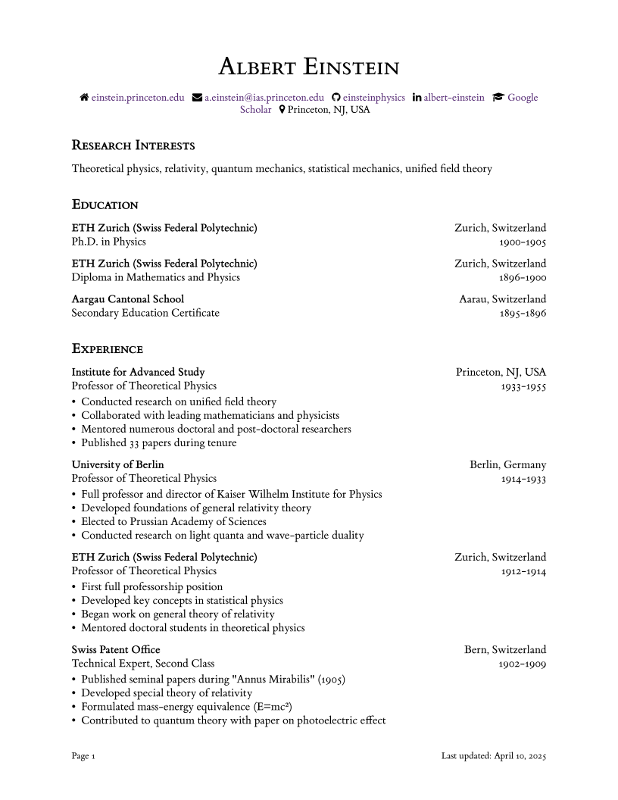

# CleanCV :soap: :scroll: : Modern, mimimal, and modular

CleanCV is a modern, minimal, and modular academic LaTeX CV template. 

This CV is designed for academics, students, and researchers in STEM. It prioritizes readability, ease-of-use, clean design, and typography. It contains everything you need and nothing you don't. See a preview of the example CV:

<p align="center">
  
  
</p>

## Overview :rocket:

CleanCV stands out from other academic templates with:

- **Readable and commented style file** you'll actually understand
- **Exceptional typography** using elegant spacing and ET Book font
- **Modular structure** with two main entry types for all content
- **Easy customization** of colors and style
- **Popular CV sections** are included by default:
    - Research interests, education, experience, publications, awards & honors, skills, talks & presentations, teaching, service, code & software
 
Specific features :sparkles: include:
- **Contact bar with icons** for personal info and social media
- **CV/Resume dual mode** with conditional section display
- **BibLaTeX integration** for seamless use with `publications.bib`
- **Automatic name bolding** for your name in publications
- **Support for joint first author** annotations in publications
- **Last-updated date** automatically generated

## Setup :gear:

### Option 1: Use on Overleaf (Recommended)
1. Create a [new Overleaf project](https://www.overleaf.com/learn/how-to/Creating_a_document_in_Overleaf)
2. Copy the `main.tex`, `cleanCV.sty`, and `publications.bib` files to your Overleaf project

If you have Overleaf premium, you can instead use this template to create a new Github repo and then sync it directly with Overleaf ([instructions](https://www.overleaf.com/learn/how-to/GitHub_Synchronization#Creating_a_new_Overleaf_project_from_a_GitHub_repository)).

### Option 2: Use Locally
1. Install Tex/LaTeX ([get LaTeX](https://www.latex-project.org/get/))
2. Use this template to create a new Github repo
3. Clone your new Github repo locally: `git clone https://github.com/yourusername/CleanCV.git`

## Philosophy :bulb:

CleanCV is built around a simple, consistent structure that makes your CV visually appealing and easy to maintain:

1. **Sections:** Main content divisions (Education, Experience, Publications, etc.)
2. **Subsections:** Optional subdivisions within sections (e.g. Posters under Talks)
3. **Entries:** Individual items using one of two standardized commands

### Entry Types

CleanCV provides two complementary commands for different types of CV entries:

1. **`\cvdetail`**: For comprehensive entries that require organization details and optional descriptions
   - Used for major entries like education and work experience
   - Supports optional bullet points for achievements and responsibilities
   - Creates a structured, two-line format with organization and location on top, role and dates below

2. **`\cvsimple`**: For concise, single-line entries without bullet points
   - Used for awards, talks, service, etc.
   - Creates a compact, single-line format with organization, title, and date
   - Typically used within itemized lists

This dual-command system creates a consistent visual hierarchy while accommodating varying CV content.

## Usage Guide :pencil:

### Header and Contact Bar
At the top of `main.tex` fill in your personal info and social media:
```latex
\cvname{Your Name}
\contactbar{website.com}{email@example.com}{github-username}{linkedin-username}{scholar-url}{Location}
```

### Primary CV Entries (`\cvposition`)
For major entries like education and experience (each entry is _not_ part of a list):

```latex
% Syntax:
\cvposition[<optional bullet points>]{Organization}{Location}{Title}{Date}

% Education example:
\section*{Education}
\cvposition{Stanford University}{Stanford, CA}{Ph.D. in Computer Science}{2018-2023}
\medskip
\cvposition{MIT}{Cambridge, MA}{B.S. in Computer Science}{2014-2018}

% Experience example with bullet points:
\section*{Experience}
\cvposition[
    \item Developed machine learning algorithms for natural language processing
    \item Published 3 papers in top-tier conferences
]{Google Research}{Mountain View, CA}{Research Scientist}{2021-Present}
```

### Secondary CV Entries (`\cvitem`)
For compact entries like awards, talks, and service (each entry _is_ part of a list):

```latex
% Syntax (used within itemize environment):
\item \cvitem{Organization}{Title}{Date}

% Awards example:
\section*{Awards \& Honors}
\begin{itemize}
    \item \cvitem{ACM SIGCHI}{Best Paper Award}{2023}
    \item \cvitem{National Science Foundation}{Graduate Research Fellowship}{2021-2024}
\end{itemize}

% Talks example:
\section*{Invited Talks}
\begin{itemize}
    \item \cvitem{Stanford University}{Machine Learning for Climate Science}{March 2023}
    \item \cvitem{ACM Conference}{Advances in Natural Language Processing}{December 2022}
\end{itemize}
```

### Bibliography Management

CleanCV automatically integrates with BibLaTeX for publication lists. Additionally:

1. Make your name bold in the bibliography at the top of `main.tex`:
   ```latex
   \boldname{YourLastName}{YourFirstName}{Y}
   ```

2. Mark joint first-authors in your `publications.bib` file:
   ```
   @article{keyname,
     title={Paper Title},
     author={Your Name and Colleague Name},
     journal={Journal Name},
     year={2023},
     annote={jointfirst}
   }
   ```

### CV/Resume Mode

Switch between a comprehensive CV or a condensed resume by commenting out a line at the top of `main.tex`:

```latex
\cvtrue  % Full CV (all sections)
% \cvfalse % Resume (limited sections)
```

The sections included in the resume are determined 

## Acknowledgments :raised_hands:

CleanCV is a customized version of the academic LaTeX CV template from [Dr. Corey Stephan](https://github.com/historical-theology/cv) and (mostly) [Dr. Bastian Rieck](https://github.com/Pseudomanifold/latex-cv).